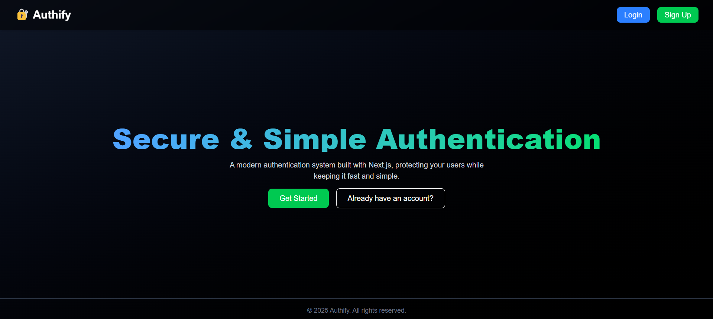
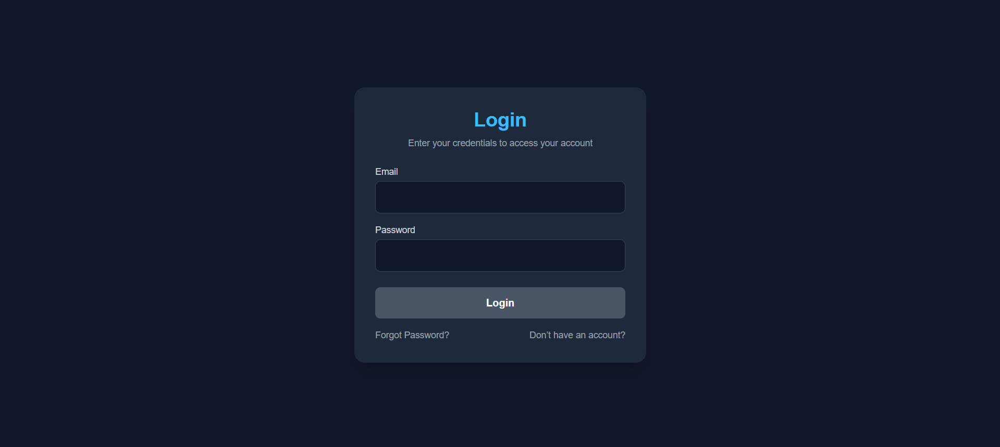
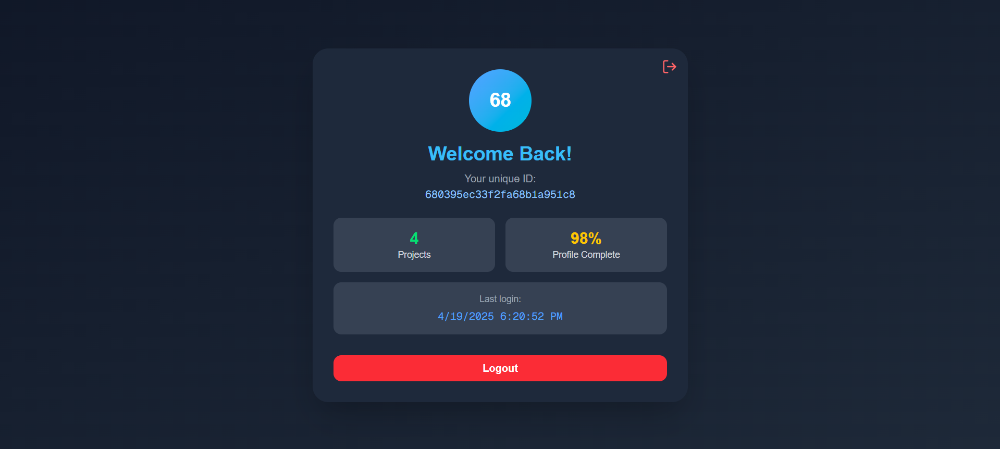

Sure! Here's a clean, professional, and attractive `README.md` for your Next.js authentication project:

---

# 🔐 Authify — Next.js Authentication System

Authify is a secure and modern authentication system built using **Next.js 13+ App Router**, **MongoDB**, and **Tailwind CSS**. It features email verification, login, signup, forgot/reset password flow, and protected routing — all bundled with a beautiful UI.

---

## ✨ Features

- ✅ Signup with email verification link
- ✅ Login only after verified email
- ✅ Secure password hashing with bcrypt
- ✅ JWT-based authentication with cookies
- ✅ Forgot Password & Reset Password
- ✅ Toast notifications for feedback
- ✅ Protected routes using middleware
- ✅ Responsive and theme-consistent UI

---

## 🔧 Tech Stack

- **Next.js 13+ (App Router)**
- **MongoDB + Mongoose**
- **Tailwind CSS**
- **TypeScript**
- **JWT & bcryptjs**
- **React Hot Toast**
- **Lucide Icons**

---

## 🚀 Getting Started

### 1. Clone the repository

```bash
git clone https://github.com/your-username/authify.git
cd authify
```

### 2. Install dependencies

```bash
npm install
# or
yarn install
```

### 3. Setup environment variables

Create a `.env.local` file in the root and add:

```env
MONGODB_URI=your_mongodb_connection_string
TOKEN_SECRET=your_jwt_secret
BASE_URL=http://localhost:3000
```

> 🔑 Make sure your MongoDB cluster is accessible and the URI is correct.

---

### 4. Run the development server

```bash
npm run dev
# or
yarn dev
```

Visit [http://localhost:3000](http://localhost:3000) in your browser.

---

## 📁 Folder Structure

```
/app
  /login
  /signup
  /profile/[id]
  /verifyemail
  /forgotpassword
  /resetpassword
/api/users
/models
/dbConfig
/middleware
```

---

## 🔒 Security Highlights

- Passwords hashed with **bcryptjs**
- Tokens signed with **JWT**
- Tokens stored in **httpOnly** cookies
- Email verification before login
- Reset password via email token

---

## 📸 Screenshots

| Landing Page                     | Login Page                  | Profile Page                    |
|-------------------------------|-------------------------------------|----------------------------------|
|  |  |  |

> 📷 Add your own screenshots in `public/screens` and update paths above.

---

## 🛠️ Customization

- 🔁 Update email sending logic in `utils/mailer.ts`
- 🎨 Modify theme & UI in `Tailwind config` or components
- 🔒 Configure token expiry or cookie options in `api/users/login/route.ts`

---

## 📬 Feedback & Contribution

Have ideas or found a bug?  
Feel free to open an issue or submit a pull request!  
Let's build secure, fast, and delightful auth together.

---

## 📄 License

This project is licensed under the [MIT License](LICENSE).
